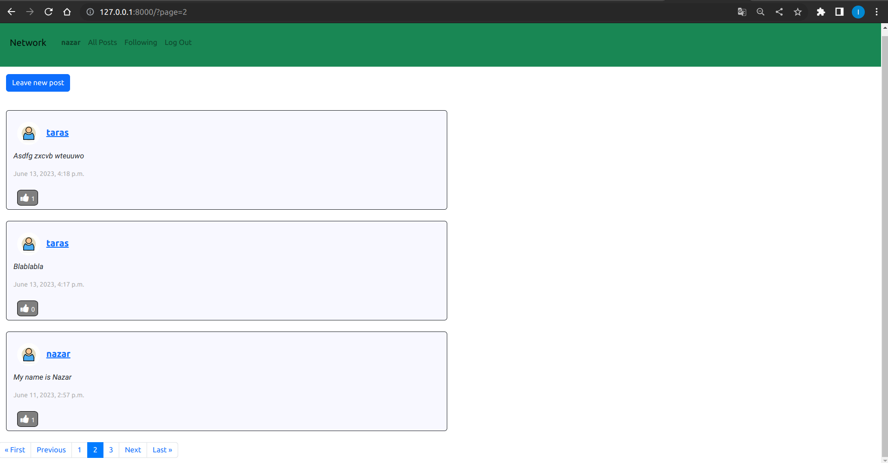
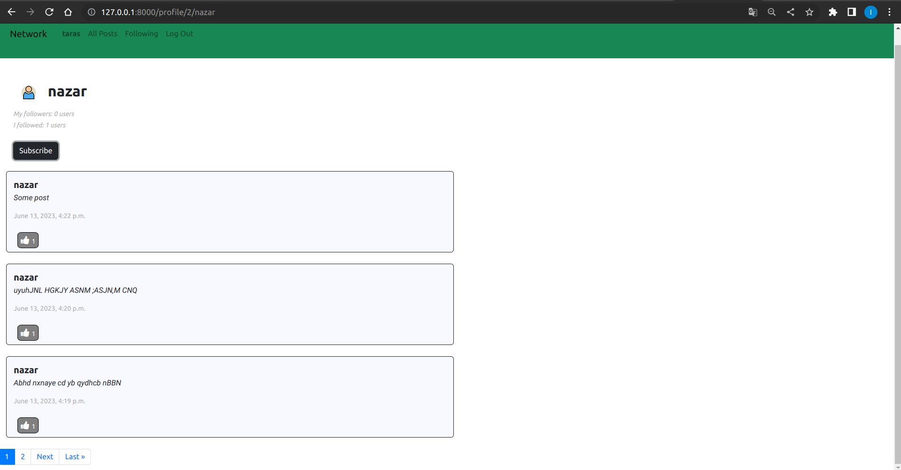
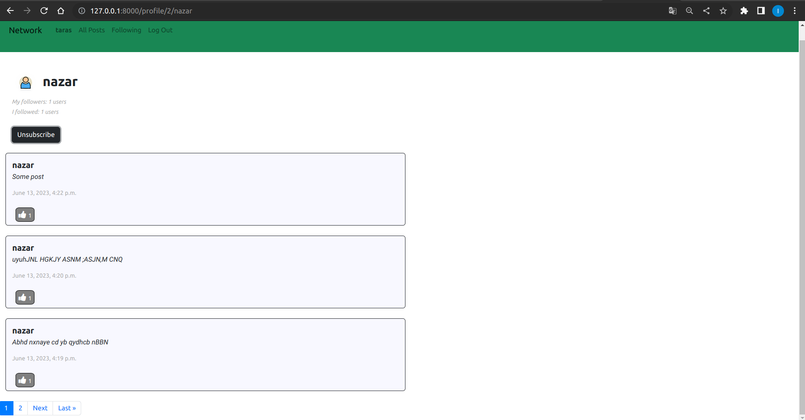
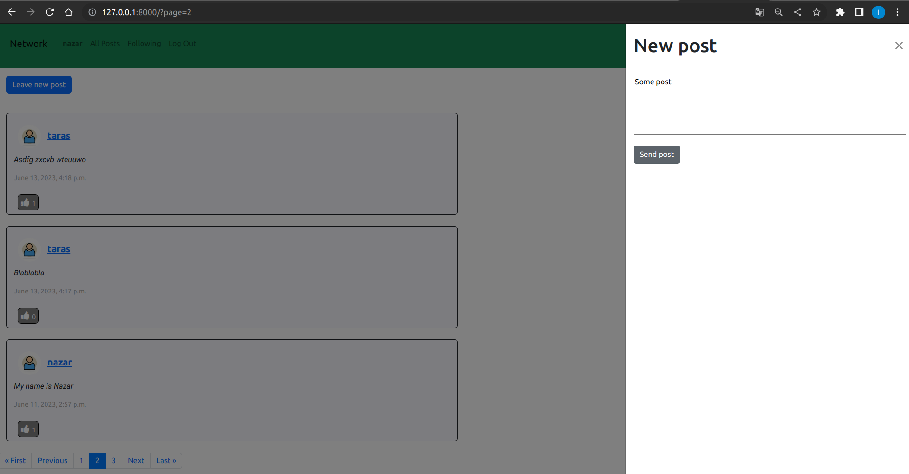
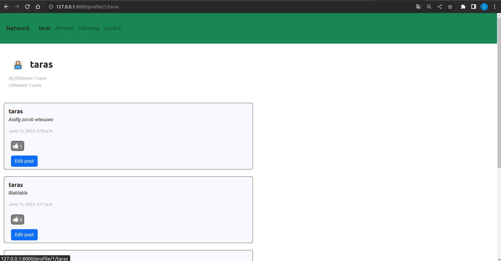
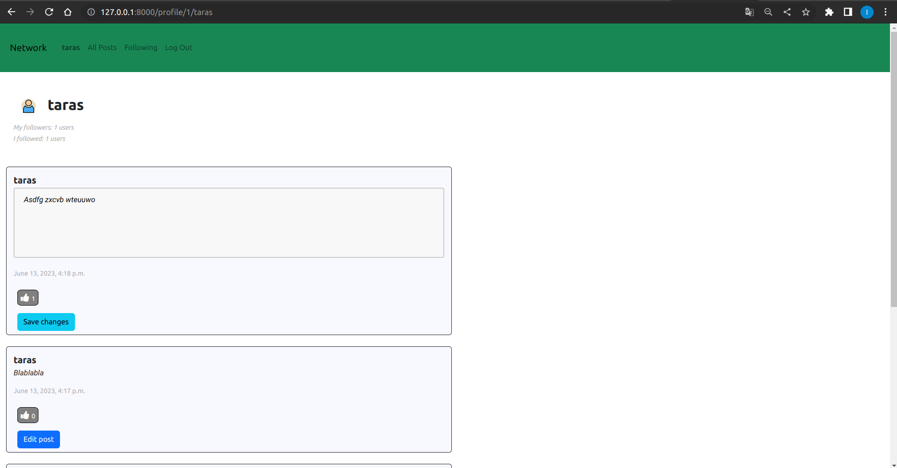
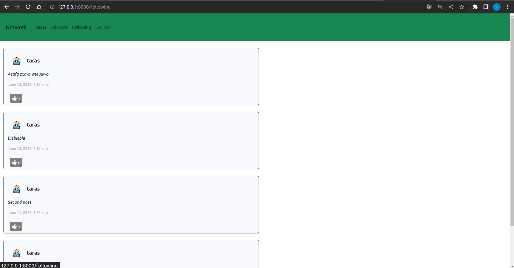

# network
This Django project is a social network site similar to Twitter where you can create posts and follow users. This is the fifth practical task from the course "Web Programming with Python and JavaScript CS50"

